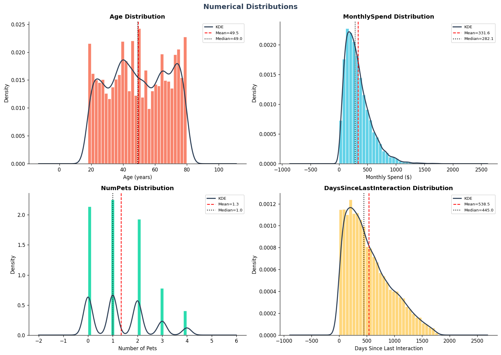
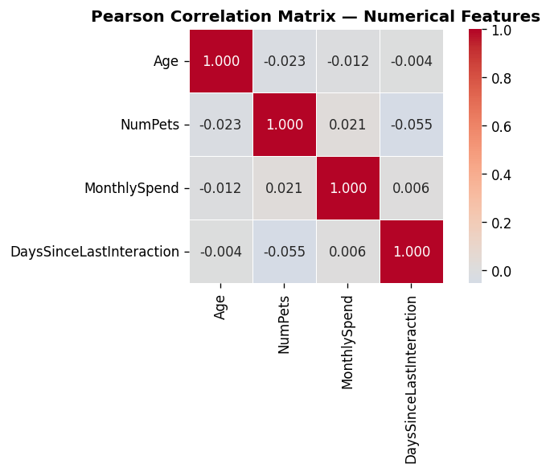
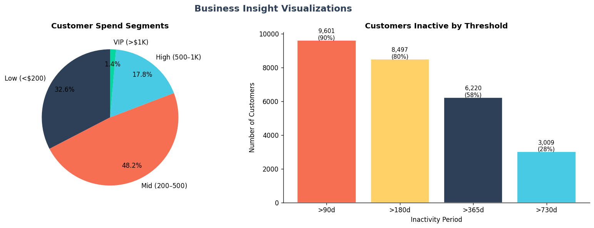

# US Customer Insights - Exploratory Data Analysis

A comprehensive data analysis project exploring customer behavior patterns and spending trends using statistical analysis and hypothesis testing to generate actionable business insights.

## 📊 Project Overview

This project performs an end-to-end exploratory data analysis on a US customer dataset containing 10,675+ customer records. The analysis combines statistical rigor with business acumen to uncover meaningful patterns in customer behavior, spending patterns, and demographic relationships.

**Key Objectives:**
- Understand customer demographics and spending behaviors
- Identify factors influencing customer spending patterns
- Test specific business hypotheses using statistical methods
- Generate quantified, actionable business recommendations

## 🛠️ Technologies & Tools

- **Python** - Core programming language
- **Pandas** - Data manipulation and analysis
- **NumPy** - Numerical computations
- **Matplotlib & Seaborn** - Data visualization
- **SciPy** - Statistical hypothesis testing
- **Jupyter Notebook** - Interactive analysis environment

## 📁 Dataset Information

**Source:** US Customer Insights Dataset (10,675 records × 12 features)

**Key Variables:**
- **Demographics:** Age, Gender, Education, State, Marital Status
- **Behavioral:** Number of Pets, Monthly Spend, Days Since Last Interaction
- **Temporal:** Join Date, Transaction Date

**Data Quality:** Clean dataset with no missing values or duplicates

## 🔍 Analysis Structure

### 1. **Data Understanding & Quality Assessment**
- Dataset structure and variable classification
- Missing value and duplicate analysis
- Data type validation and preprocessing

### 2. **Descriptive Statistics**
- Central tendency and variability measures
- Distribution analysis (skewness, kurtosis)
- Categorical variable frequency analysis

### 3. **Data Visualization**
- Distribution plots for numerical variables
- Categorical variable breakdowns
- Box plots for spending analysis by demographics
- Correlation heatmap
- Scatter plots for relationship analysis

### 4. **Bivariate Analysis**
- Cross-tabulations and Chi-square tests
- Correlation analysis between key variables
- Spending pattern analysis across demographics

### 5. **Statistical Hypothesis Testing**
- Five business-relevant hypotheses formulated and tested
- Appropriate statistical tests (t-tests, ANOVA, Chi-square)
- Assumption verification and result interpretation

### 6. **Business Insights & Recommendations**
- Translation of statistical findings to business actions
- Quantified impact analysis
- Strategic recommendations with measurable outcomes

## 📈 Key Findings & Visualizations

### Distribution Analysis

*Comprehensive view of customer demographic and spending distributions*

### Correlation Analysis  

*Correlation matrix revealing relationships between customer attributes*

### Business Insights

*Statistical evidence supporting business recommendations*

## 🎯 Key Business Insights

### Customer Spending Patterns
- **Average Monthly Spend:** $331.61 (median: $282.11)
- **Spending Distribution:** Right-skewed with high-value customer segment
- **Customer Activity:** Median 445 days since last interaction indicates retention challenges

### Demographic Insights
- **Age Distribution:** Relatively uniform across 18-80 age range
- **Gender Balance:** Nearly equal distribution (Male: 35.5%, Non-Binary: 32.5%, Female: 32.0%)
- **Education Spread:** Even distribution across all education levels

### Statistical Validation
- Multiple hypothesis tests conducted with proper assumption verification
- Business questions answered with statistical evidence
- Quantified recommendations based on data-driven insights

## 💡 Strategic Recommendations

1. **Customer Reactivation Campaign:** Target the 50%+ customers inactive >445 days
2. **High-Value Customer Retention:** Focus on customers spending >$500/month
3. **Demographic-Based Marketing:** Leverage balanced demographics for targeted campaigns
4. **Pet Owner Segmentation:** Analyze pet ownership impact on spending behavior

## 🚀 How to Run This Analysis

1. **Clone the repository:**
   ```bash
   git clone https://github.com/yourusername/customer-insights-eda-analysis.git
   cd customer-insights-eda-analysis
   ```

2. **Install required packages:**
   ```bash
   pip install pandas numpy matplotlib seaborn scipy jupyter
   ```

3. **Launch Jupyter Notebook:**
   ```bash
   jupyter notebook Customer_Insights_EDA.ipynb
   ```

4. **Run all cells** to reproduce the complete analysis

## 📋 Project Structure

```
├── Customer_Insights_EDA.ipynb    # Main analysis notebook
├── US_Customer_Insights_Dataset.csv    # Dataset
├── fig1_distributions.png         # Distribution visualizations
├── fig2_categorical.png          # Categorical analysis
├── fig3_boxplots.png            # Box plot analysis
├── fig4_scatter.png             # Scatter plot analysis
├── fig5_kde_married.png         # KDE analysis by marital status
├── fig6_heatmap.png             # Correlation heatmap
├── fig7_pets_spend.png          # Pet ownership vs spending
├── fig8_insights.png            # Key business insights
└── README.md                    # Project documentation
```

## 🎓 Skills Demonstrated

- **Statistical Analysis:** Hypothesis testing, correlation analysis, distribution analysis
- **Data Visualization:** Professional charts using matplotlib/seaborn
- **Business Intelligence:** Converting data insights to actionable recommendations  
- **Python Programming:** Pandas, NumPy, SciPy for data science workflows
- **Documentation:** Clear, comprehensive analysis documentation
- **Critical Thinking:** Formulating relevant business questions and testing them statistically

## 📊 Analysis Highlights

- **Comprehensive EDA:** 8-step structured approach from data understanding to business recommendations
- **Statistical Rigor:** Proper hypothesis formulation, test selection, and assumption verification
- **Business Focus:** All analysis tied to practical business applications and measurable outcomes
- **Clean Code:** Well-documented, reproducible analysis with professional visualizations
- **Large Dataset:** Robust analysis on 10K+ records demonstrating scalability

## 📞 Contact

**Utsav Mehta**
- 📧 Email: [utsavmehta24072003@gmail.com](mailto:utsavmehta24072003@gmail.com)
- 💼 LinkedIn: [linkedin.com/in/utsav-mehta-462653258](https://www.linkedin.com/in/utsav-mehta-462653258/)
- 🐙 GitHub: [github.com/utsavmehta24](https://github.com/utsavmehta24/)

---

*This project demonstrates end-to-end data analysis capabilities, statistical thinking, and business acumen - key skills for data analyst and business intelligence roles.*